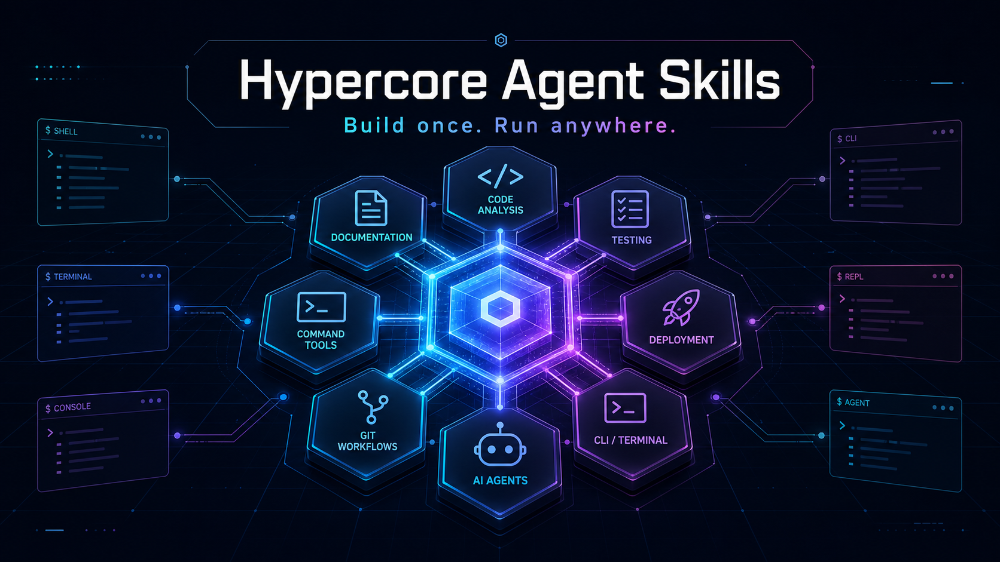

# Hypercore Agent Skills

<p align="center">
  
</p>

> Claude Code · Codex · Cursor · Antigravity에서 그대로 쓰는 한국어 우선 AI 에이전트 스킬 모음.

Hypercore는 코드베이스 분석부터 릴리스까지의 반복 작업을 한 번에 줄여주는 30개 스킬을 한 패키지로 제공합니다. 각 스킬은 트리거, 워크플로, 검증 게이트가 명시되어 있어 어떤 CLI에서 호출해도 같은 의도로 동작합니다.

- **표준 설치**: 모든 지원 런타임에서 `npx skills` 하나로 설치하고 관리.
- **다중 CLI**: Claude Code, Codex, Cursor, Antigravity에서 동일하게 사용.
- **한국어 우선**: 모든 스킬에 한국어 사양이 정렬되어 있으며 영어 원본도 함께 유지.
- **검증 가능한 결과물**: 각 스킬은 evidence/validation/stop-condition 계약을 따라 결과를 남깁니다.

[Vercel Skills](https://github.com/vercel-labs/skills) 구조 위에 만들어졌습니다.

## 호환성

Hypercore는 [Vercel Skills CLI](https://github.com/vercel-labs/skills)의 원격 소스 규약만 지원합니다. Claude Code, Codex, Cursor 등 런타임 선택은 `npx skills`의 `--agent` 옵션으로 처리하며 별도 plugin/marketplace adapter는 제공하지 않습니다.

| 런타임 | 설치 예시 | 비고 |
|---|---|---|
| Claude Code | `npx skills@1.5.21 add alpoxdev/hypercore-skills -a claude-code` | 프로젝트 설치가 기본 |
| Codex CLI | `npx skills@1.5.21 add alpoxdev/hypercore-skills -a codex` | project/global 모두 `.agents/skills` canonical 경로 사용 |
| Cursor | `npx skills@1.5.21 add alpoxdev/hypercore-skills -a cursor` | `npx skills` 표준 대상 |
| 기타 | `npx skills@1.5.21 add alpoxdev/hypercore-skills` | CLI가 지원하는 agent에 한함 |

스킬별 실행 호환은 아래 [스킬 카탈로그](#스킬-카탈로그)의 **호환** 컬럼 또는 각 `SKILL.md`의 `compatibility` 필드에서 확인합니다.

## 설치 및 수명주기

모든 스킬을 현재 프로젝트에 설치:

```bash
npx skills@1.5.21 add alpoxdev/hypercore-skills --skill '*' -y
```

특정 agent 또는 스킬만 설치:

```bash
npx skills@1.5.21 add alpoxdev/hypercore-skills -a claude-code --skill git-maker -y
npx skills@1.5.21 add alpoxdev/hypercore-skills -a codex --skill readme-maker -y
```

`-g`/`--global`을 추가할 때만 사용자 전역에 설치됩니다. `--copy`는 설치 시 독립 복사본을 만들며, 생략 시 CLI가 대상 조합에 따라 canonical copy 또는 symlink를 선택합니다.

설치 후에는 같은 CLI로 전체 수명주기를 관리합니다:

```bash
npx skills@1.5.21 list
npx skills@1.5.21 update
npx skills@1.5.21 remove git-maker
npx skills@1.5.21 use alpoxdev/hypercore-skills --skill git-maker
npx skills@1.5.21 find hypercore --owner alpoxdev
npx skills@1.5.21 init my-skill
```

`update`와 `remove`는 원격 source 정보가 기록된 lock에 의존합니다. 로컬 경로 복사나 기존 plugin 설치에는 이 provenance가 없으므로, 아래처럼 원격 source로 다시 설치해야 합니다.

### 기존 plugin 또는 lock 없는 설치 마이그레이션

1. 기존 스킬을 백업하고 사용 중인 runtime의 plugin/marketplace 설치를 제거합니다.
2. 실제 원격 source를 지정해 원하는 scope와 agent로 다시 설치합니다.
3. `npx skills@1.5.21 list --json`과 project `skills-lock.json` 또는 global `.skill-lock.json`에서 source가 `alpoxdev/hypercore-skills`인지 확인합니다.
4. 이후 `update`와 `remove`를 실행합니다.

```bash
npx skills@1.5.21 add alpoxdev/hypercore-skills -a codex --skill '*' -y
npx skills@1.5.21 list --json
npx skills@1.5.21 update
```

Codex는 universal agent이므로 project에서는 `<cwd>/.agents/skills`, global에서는 `$HOME/.agents/skills`가 canonical 설치 경로입니다. `$CODEX_HOME/skills`는 primary 설치/list 경로가 아닙니다. Claude+Codex를 함께 설치할 때 Codex는 canonical 경로를 사용하고 Claude 경로에는 CLI가 symlink를 만들 수 있습니다.

`skills@1.5.21` lock은 원래 선택한 agent 집합이나 `--copy` mode를 저장하지 않습니다. 따라서 `update`는 agent/mode 보존을 보장하지 않으며, 특정 topology가 필요하면 같은 remote source를 원하는 옵션으로 다시 `add`하세요. 부분 `remove` 뒤 provenance 보존도 보장하지 않습니다. 일부 agent만 제거해 남은 파일이 있더라도 계속 update 관리하려면 remote source로 다시 설치해야 합니다.

### 소스에서 직접 사용

레포를 클론해 그대로 가져다 써도 됩니다 (CI나 CLI 빌드/실행에는 별도 의존성이 필요하지 않습니다 — 스킬은 모두 마크다운입니다):

```bash
git clone https://github.com/alpoxdev/hypercore-skills.git
# 원하는 스킬 디렉터리를 자신의 프로젝트로 복사
cp -R hypercore-skills/skills/git-maker your-project/.claude/skills/
```

## 빠른 사용 예시

설치 후 자연어로 호출하거나 슬래시 명령으로 시작합니다.

```text
/git-maker            # 변경 사항을 그룹별로 커밋하고 푸시까지 한 번에
/readme-maker         # 코드를 읽고 프로젝트의 실제 모양에 맞는 README 생성/리팩터
/agentmd-maker        # 저장소를 읽고 프로젝트 전용 AGENTS.md 생성/리팩터
/research "<주제>"    # 출처가 있는 다중 소스 리서치 보고서
/prd-maker "<아이디어>"  # 다이어그램·플로우·와이어프레임을 포함한 기획 패키지
/pre-deploy           # 배포 전 lint/타입/빌드 게이트
```

자연어로도 트리거됩니다 — 예: "이 프로젝트 README 다시 써줘" → `readme-maker`, "이 저장소에 맞는 AGENTS.md 만들어줘" → `agentmd-maker`, "방금 변경 사항 커밋하고 푸시" → `git-maker`.

## 스킬 카탈로그

용도별 분류입니다. 같은 스킬이 둘 이상의 그룹에 어울릴 수 있습니다.

### 스킬·문서 작성

| 스킬 | 설명 | 호환 |
|------|------|------|
| `skill-maker` | 유지보수하기 쉬운 Codex/AI 에이전트 스킬 생성 및 리팩터링 | All |
| `skill-tester` | 스킬 트리거/동작을 시나리오 기반으로 검증 | All |
| `autoresearch-skill` | 반복 실행과 이진 eval 기반으로 기존 스킬을 자동 최적화 | All |
| `readme-maker` | 코드베이스 분석 기반 README 생성 및 리팩터링 | All |
| `agentmd-maker` | 저장소 근거 기반 `AGENTS.md` 생성·리팩터링 및 선택적 `CLAUDE.md` 조정 | All |
| `docs-maker` | AI가 읽기 좋은 구조화된 문서/룰 팩 생성 | All |
| `prd-maker` | 증거 기반 Living PRD + 다이어그램·플로우·와이어프레임 생성 | All |
| `design-md-maker` | 프로젝트별 `DESIGN.md` 디자인 시스템 문서 생성 및 갱신 | All |

### 아키텍처 가드

| 스킬 | 설명 | 호환 |
|------|------|------|
| `nextjs-architecture` | Next.js App Router 아키텍처 규칙 적용 | All |
| `hono-architecture` | Hono 아키텍처 규칙 적용 | All |
| `tanstack-start-architecture` | TanStack Start 아키텍처 규칙 적용 | All |
| `tanstack-start-security` | TanStack Start 인증/세션/보안 규칙 적용 | All |
| `vite-architecture` | Vite + TanStack Router 아키텍처 규칙 적용 | All |
| `tauri-architecture` | Tauri 2 + Vite + React + TanStack Router/Query 데스크톱 아키텍처 규칙 적용 | All |

### 빌드 · 배포 · 릴리스

| 스킬 | 설명 | 호환 |
|------|------|------|
| `pre-deploy` | 배포 전 lint/타입/빌드 검증 | All |
| `deploy-fix` | 빌드/CI/배포 장애 진단 및 수정 | All |
| `version-update` | 시맨틱 버전 업데이트 및 릴리스 | All |
| `autoresearch-code` | 반복 실험·이진 eval 기반 코드베이스 자동 최적화 | All |

### Git 워크플로

| 스킬 | 설명 | 호환 |
|------|------|------|
| `git-maker` | 커밋과 푸시를 한 번에 (worktree 인지) | All |
| `git-worktree` | Git worktree 생성/진입/정리, 병렬 에이전트 워크스페이스 관리 | All |
| `git-issue` | GitHub issue 생성/재개와 matching branch 세션 전환 | All |

### 리서치 · 디버깅 · QA

| 스킬 | 설명 | 호환 |
|------|------|------|
| `research` | 다중 소스, 출처 추적 가능한 마크다운 리서치 보고서 | All |
| `client-feedback` | 고객사 피드백을 코드 영향·선택지·리스크로 해석하고 확인 후 구현 | All |
| `bug-fix` | 버그 분석 → 수리 옵션 제시 → 검증된 구현 | All |

### 콘텐츠 · SEO

| 스킬 | 설명 | 호환 |
|------|------|------|
| `seo-maker` | SEO / AEO / GEO 통합 분석 및 최적화 리포트 | All |
| `image-maker` | 관찰된 이미지 기능으로 이미지를 생성하고, 미지원 환경에서는 실행 가능한 프롬프트를 안전하게 저장 | Capability-based |

### 실행 보조

| 스킬 | 설명 | 호환 |
|------|------|------|
| `execute` | 난이도 적응형 사고 깊이로 즉시 작업 수행 | All |

### 도메인 도구

| 스킬 | 설명 | 호환 |
|------|------|------|
| `color-cli` | `@kood/color-cli` 기반 hex / rgb / oklch 색상 변환 | All |

총 30개 스킬. 새 스킬은 `skills/<이름>/` 디렉터리를 추가하기만 하면 됩니다 — 자세한 형태는 [스킬 만들기](#스킬-만들기) 참고.

## 시나리오 예시

**1) 기존 프로젝트의 README가 오래됐을 때**

```text
이 저장소를 꼼꼼히 읽고 README를 다시 써줘
```

`readme-maker`가 매니페스트, 진입점, 스크립트, 라이선스, 기존 문서를 스캔해 프로젝트 형태(CLI/라이브러리/플러그인 등)에 맞는 섹션을 골라 작성합니다. 명령·API를 지어내지 않고, 모르는 부분은 `<!-- TODO -->`로 표시합니다.

**2) 모은 변경사항을 안전하게 출고**

```text
/git-maker ALL
```

변경을 논리 단위로 묶어 Conventional Commit으로 나눠 커밋하고, 모든 커밋이 성공한 뒤에만 자동으로 푸시합니다. `main`/`master`에 대한 force push는 차단됩니다.

**3) 배포 전 점검**

```text
/pre-deploy
```

lint, typecheck, build, test 같은 프로젝트 게이트를 재현하고, 실패가 있으면 원인을 추적해서 고쳐 다시 검증합니다.

**4) 새 스킬 만들기**

```text
/skill-maker "내가 자주 쓰는 워크플로를 스킬로 만들어줘"
```

`skill-maker`가 트리거 디자인, 리소스 배치, 검증 체크리스트까지 갖춘 스킬 폴더를 만들어 냅니다. 이후 `autoresearch-skill`로 baseline-first 반복 최적화를 돌릴 수 있습니다.

## 프로젝트 구조

```text
hypercore-skills/
├── agents/                # 사용자 정의 에이전트 자리 (현재 비어 있음)
├── cli/                   # @kood/* 도구 모노레포 (pnpm workspace)
│   └── packages/
│       └── color/         # @kood/color-cli — color-cli 스킬이 호출
├── instructions/          # 프로젝트 LLM 작업 베이스 (context/harness/sourcing/validation)
├── scripts/               # source/lifecycle 검증 및 보조 스크립트
└── skills/                # 30개 스킬의 단일 원본 (각 폴더에 SKILL.md / SKILL.ko.md)
```

스킬 한 개의 표준 구조:

```text
skills/<name>/
├── SKILL.md               # 영어 정본 — 트리거, 워크플로, 검증
├── SKILL.ko.md            # 한국어 번역
├── rules/                 # 재사용 가능한 정책/체크리스트 (옵션)
├── references/            # 외부 도큐먼트, 스키마, 깊은 디테일 (옵션)
├── scripts/               # 결정적 실행 헬퍼 (옵션)
└── assets/                # 출력 템플릿/리소스 (옵션)
```

## 스킬 만들기

직접 스킬을 만들고 싶다면:

1. `/skill-maker "<설명>"` — 빈 폴더부터 lean한 `SKILL.md`까지 한 번에.
2. `/autoresearch-skill <skill-path>` — 만들어진 스킬을 반복 실험으로 점수가 올라가지 않을 때까지 자동 최적화.
3. 영어 정본(`SKILL.md`) 옆에 한국어 번역(`SKILL.ko.md`)을 함께 유지하세요.
4. PR이 반영되면 `npx skills@1.5.21 add alpoxdev/hypercore-skills --list`로 저장소의 `skills/` 원격 source에서 발견되는지 확인합니다.

세부 설계 가이드는 [`skills/skill-maker/SKILL.md`](skills/skill-maker/SKILL.md)와 [`instructions/`](instructions/)를 참고하세요.

## 인스트럭션 베이스

`instructions/` 폴더에는 모든 스킬이 따르는 공통 작업 원칙이 정리되어 있습니다.

문서는 `skills/`와 동일하게 **이중 언어 쌍**으로 관리합니다 — `X.md`가 영어, `X.ko.md`가 한국어입니다. 한쪽만 고치면 안 되며, 두 파일은 같은 계약을 담아야 합니다.

| 영역 | 위치 | 목적 |
|---|---|---|
| Context Engineering | [`instructions/context-engineering/`](instructions/context-engineering/) | 프롬프트·컨텍스트·도구 지시를 런타임 중립으로 설계 |
| Harness Engineering | [`instructions/harness-engineering/`](instructions/harness-engineering/) | 프롬프트·에이전트·도구 사용을 테스트 가능한 하네스로 관리 |
| Sourcing | [`instructions/sourcing/`](instructions/sourcing/) | 자료 조사·검색·출처 검증 기준 |
| Validation | [`instructions/validation/`](instructions/validation/) | 작업 완료 전 검증 기준 |

자세한 적용 순서는 [`instructions/README.ko.md`](instructions/README.ko.md) (영어: [`instructions/README.md`](instructions/README.md)).

## 개발

CLI 패키지(`cli/`)만 빌드/테스트가 필요합니다. 스킬은 모두 마크다운이므로 빌드 단계가 없습니다.

```bash
pnpm install            # cli/ 워크스페이스 의존성 설치
pnpm -C cli build       # 모든 cli 패키지 빌드 (현재: @kood/color-cli)
pnpm -C cli test        # 모든 cli 패키지 테스트
pnpm -C cli lint        # ESLint 9
pnpm -C cli format      # Prettier
```

새 스킬을 추가했을 때:

1. [README의 스킬 표](#스킬-카탈로그)와 `npx skills@1.5.21 add alpoxdev/hypercore-skills --list` 결과를 갱신·확인.
2. `skill-tester`로 트리거/동작을 검증.
3. `autoresearch-skill`로 점수 plateau까지 다듬는 것을 권장.

## 기여

PR 환영합니다. 작업 흐름:

1. 이슈를 열거나 기존 이슈에 의도를 적습니다 (한국어/영어 모두 환영).
2. 새 브랜치에서 변경 후 `git-maker`로 Conventional Commits를 생성합니다.
3. 스킬 변경은 `SKILL.md`(영어 정본)와 `SKILL.ko.md`(한국어 번역)을 함께 갱신합니다.
4. 가능하면 `skill-tester`나 `autoresearch-skill`의 검증 결과를 PR 본문에 첨부해 주세요.
5. 큰 구조 변경은 [AGENTS.md](AGENTS.md)의 작업 원칙(작은 변경, 되돌리기 쉬움, 전역 환경 비의존)을 따릅니다.

## 라이선스

[MIT](LICENSE) © alpoxdev.

## 감사

- [Vercel Skills](https://github.com/vercel-labs/skills) — 패키지 구조와 `npx skills add` 워크플로의 기반.
- Claude Code · Codex · Cursor · Antigravity 팀의 agent skill 생태계.
- 모든 컨트리뷰터 — 자세한 목록은 [GitHub Contributors](https://github.com/alpoxdev/hypercore-skills/graphs/contributors).
